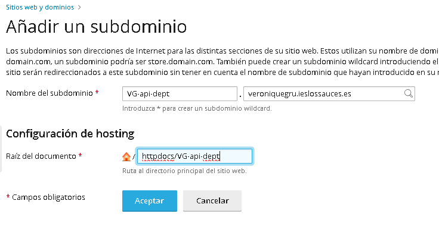
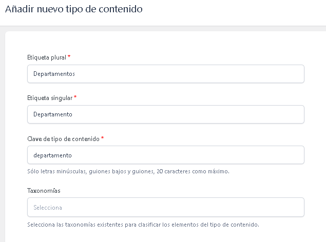
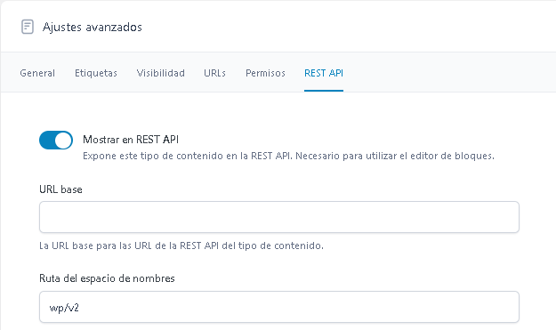
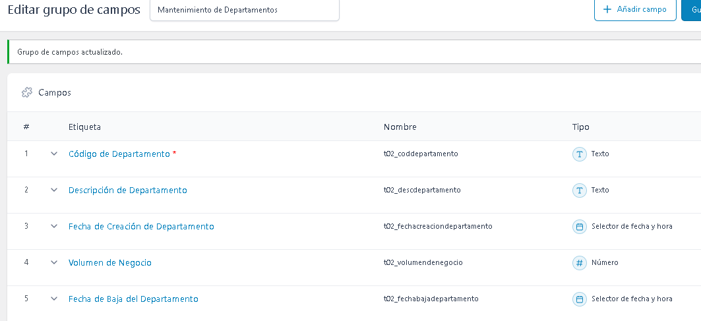
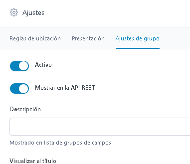
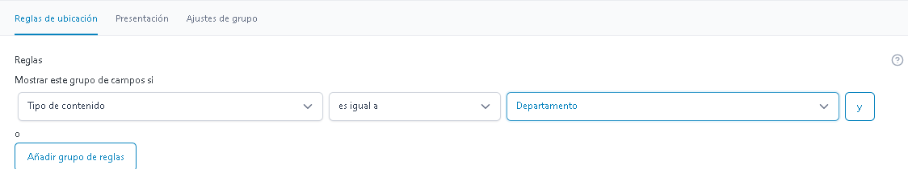
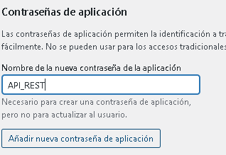
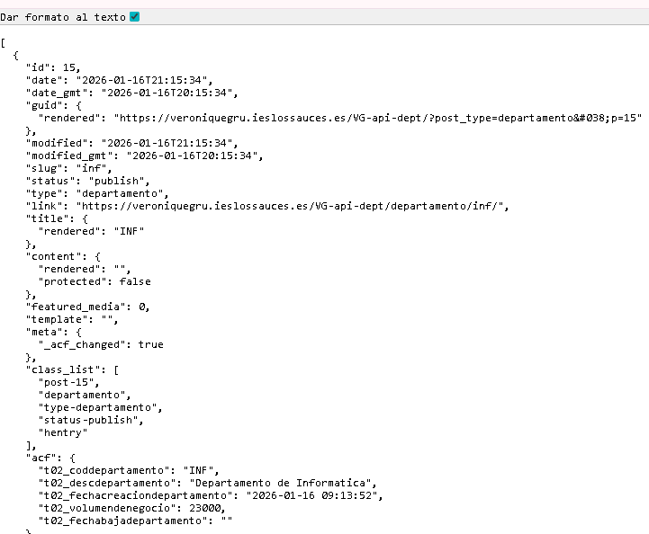

# CREAR UNA APIREST CON WORDPRESS

1. Preparación en Plesk
Se crea un subdominio: api-dept.veroniquegru.ieslossauces.es.  
  

Se instala WordPress desde el botón "WordPress" en ese nuevo subdominio dentro de Plesk. 
Plesk puede crear la base de datos y el usuario automáticamente. No se tendría que hacer nada especial, solo anotar tu usuario y contraseña de administrador.
O puedes elegir tú las credenciales.

2. Configurar el "Cerebro" (ACF + Post Type)
Una vez dentro del nuevo WordPress (/wp-admin), vamos a crear la estructura de Departamentos sin tocar código:

Se instala el plugin: Ir a Plugins > Añadir nuevo y buscar ACF (Advanced Custom Fields). Instalarlo y activarlo.

Crea el Post Type (El contenedor):

Ir al menú ACF > Tipos de contenido > Añadir nuevo.

Etiqueta plural: Departamentos.

Etiqueta singular: Departamento.

Clave de tipo de contenido: departamento (importante para la URL de la API).  
  
 
Ajustes avanzados: Activar la pestaña REST API y asegúrarse de que "Show in REST API" esté en "Yes".
  
Se guardan los cambios.

Se crean los campos específicos:

Ir a ACF > Groupos de Campos > Añadir nuevo. Poner un nombre "Mantenimiento de Departamento".

Añadir los campos:
  

Ajustes del campo: Dentro de cada campo, busca la pestaña REST API y marca "Show in REST API". (Esto es vital para que tus compañeros vean los datos).

Guardar.

1. Activar el acceso a la API
Para que otros puedan CREAR o BORRAR departamentos desde sus proyectos

Ir a Usuarios >  Perfil.

Buscar la sección Contraseñas de aplicación.

Escribe un nombre (ej: "API_REST") y dale a Añadir nueva.

Copiar la contraseña que sale. Esa contraseña, junto con el nombre de usuario, es la que se usará en el código PHP.

4. Prueba de la Api
Se crea un departamento manualmente en Departamentos > Añadir nuevo. Ponle de título INF y rellena la descripción y el volumen.

Ahora, se abre en el navegador esta URL: https://veroniquegru.ieslossauces.es/VG-api-dept/wp-json/wp/v2/departamento

y se ve el json del departamento creado

1. Crear el modelo "Departamento" en WordPress
Como WordPress usa sus propias tablas (wp_posts y wp_postmeta), no necesitas crear la tabla manualmente con SQL. Vamos a mapear tus campos:

Instala el plugin: ACF (Advanced Custom Fields).

Crea un "Post Type" llamado "Departamentos".

El título del post será tu T02_CodDepartamento (ej: INF, MAR, CON).

Crea un "Grupo de campos" en ACF y asígnalo a "Departamentos" con estos campos:

descripcion (Texto) -> Para T02_DescDepartamento.

volumen_negocio (Número) -> Para T02_VolumenDeNegocio.

fecha_baja (Fecha) -> Para T02_FechaBajaDepartamento.

La fecha de creación WordPress ya la trae por defecto.

¡IMPORTANTE!: En la configuración del Post Type en ACF, asegúrate de que la opción "Show in REST API" esté activada (viene así por defecto).

2. Cómo consultarán tus compañeros (La API)
Una vez que crees un departamento en el panel de WordPress, tus compañeros podrán ver los datos entrando a esta URL: https://veroniquegru.ieslossauces.es/wp-json/wp/v2/departamentos

Para que los campos de ACF (como el volumen de negocio) aparezcan en ese JSON, dentro de la configuración de cada campo en ACF, activa la casilla: "Show in REST API".

3. El reto: Crear/Editar desde PHP (El CRUD)
Tus compañeros (o tú desde tu otro proyecto) tendrán que enviar peticiones HTTP. WordPress requiere Autenticación para crear o borrar cosas por seguridad.

Para las pruebas de clase, lo más fácil es usar el plugin "Application Passwords" (que ya viene integrado en el núcleo de WordPress desde la versión 5.6):

Ve a tu Perfil de Usuario en WordPress.

Abajo del todo, crea una "Contraseña de aplicación" (llámala "API Clase").

Esa contraseña será la que usen tus compañeros para poder hacer el CRUD.