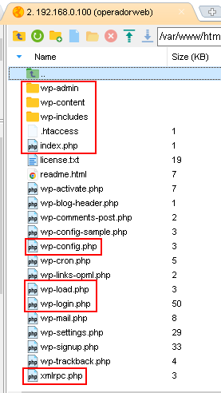
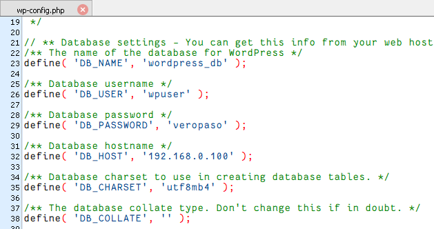
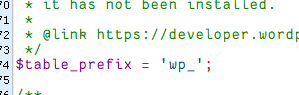
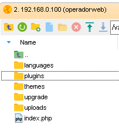
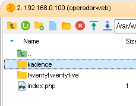
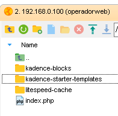
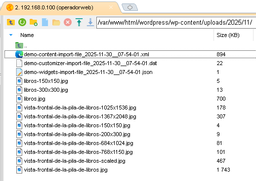
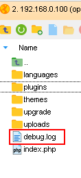

[volver al menú principal](README.md)  
[ir a Instalación de Wordpress](InstalacionWordpress.md)

# Estructura de Carpetas y Archivos de WordPress

## Índice
- [Estructura de Carpetas y Archivos de WordPress](#estructura-de-carpetas-y-archivos-de-wordpress)
  - [Índice](#índice)
  - [Estructura General](#estructura-general)
  - [Archivos Importantes](#archivos-importantes)
    - [1. wp-config.php](#1-wp-configphp)
    - [2. .htaccess](#2-htaccess)
  - [Carpeta wp-content](#carpeta-wp-content)
    - [themes/](#themes)
    - [plugins/](#plugins)
    - [uploads/](#uploads)
  - [Logs y Debug](#logs-y-debug)
    - [Ubicación de logs](#ubicación-de-logs)
    - [Activar logs en WordPress](#activar-logs-en-wordpress)

---

## Estructura General  


```
/var/www/html/wordpress/
├── wp-admin/              # archivos del panel de administración
├── wp-includes/           # archivos del núcleo de WordPress
├── wp-content/            # archivos del proyecto en curso
├── .htaccess              # Configuración Apache
├── index.php              # archivo de punto de entrada
├── wp-config.php          # configuración principal
├── wp-load.php            # archivo que carga el entorno WordPress
├── wp-login.php           # Página de login
├── xmlrpc.php             # es una característica de WordPress que permite que los datos se transmitan.
└── ...
```
En varios sitios, recomiendan desactivar xmlrpc.php por ser debilidades de seguridad(Ataques de fuerza bruta o DDoS).
Más información en este [artículo](https://www.hostinger.com/es/tutoriales/que-es-xmlrpc-php-wordpress-por-que-desactivarlo#%C2%BFQue_es_Xmlrpcphp).


---

## Archivos Importantes

### 1. wp-config.php 

**Ubicación:** `/var/www/html/wordpress/wp-config.php`

**Propósito:** Configuración principal de WordPress

**Contenido importante:**


```php
<?php
// Configuración de la base de datos
define('DB_NAME', 'wordpress_db');      // Nombre de la BD
define('DB_USER', 'wp_user');           // Usuario de la BD
define('DB_PASSWORD', 'tu_contraseña'); // Contraseña BD
define('DB_HOST', 'localhost');         // Servidor BD
define('DB_CHARSET', 'utf8mb4');        // Codificación
?>
```  
  
```php
<?php 
// Prefijo de tablas
$table_prefix = 'wp_';
?>
```  
He dejado el que venía por defecto pero se puede cambiar.  
  


### 2. .htaccess

**Ubicación:** `/var/www/html/wordpress/.htaccess`

**Propósito:** Configuración de Apache (URLs amigables, redirecciones, seguridad)

**Contenido:**
El contenido del archivo .htaccess se va generando dinamicamente y aparece esto en el de mi proyecto.  


Si hubiera algún problema con este archivo se puede buscar [aquí](https://developer.wordpress.org/advanced-administration/server/web-server/httpd/) el contenido típico según la version

Este es el contenido Básico.

```apache
# BEGIN WordPress
<IfModule mod_rewrite.c>
RewriteEngine On
RewriteBase /wordpress/
RewriteRule ^index\.php$ - [L]
RewriteCond %{REQUEST_FILENAME} !-f
RewriteCond %{REQUEST_FILENAME} !-d
RewriteRule . /wordpress/index.php [L]
</IfModule>
# END WordPress
```


---

## Carpeta wp-content

**Esta es LA CARPETA de trabajo**  
  

```
wp-content/
├── themes/           # Temas personalizados
├── plugins/          # Plugins personalizados
├── uploads/          # Archivos multimedia subidos
├── languages/        # Archivos de traducción
├── mu-plugins/       # Plugins "must-use" (siempre activos)
├── upgrade/          # Archivos temporales de actualizaciones
└── debug.log         # Log de errores (si WP_DEBUG_LOG = true)
```

### themes/

Contiene todos los temas. WordPress necesita al menos uno activo. 
Se aconseja dejar solo el que se vaya a utlizar por seguridad.  

```
themes/
├── twentytwentyfive/    # Tema por defecto de WordPress
└── kadence/             # Tema que he elegido
```


### plugins/

Plugins personalizados o de terceros.  

```
/var/www/html/wordpress/wp-content/plugins

plugins/
├── kadence-blocks              # Plugin que amplía el editor Gutenberg de Kadence
├── kadence-starter-templates   # Plugin de plantillas de kadence
├── litespeed-cache             # Plugin para optimizar y acelerar la velocidad de carga de un sitio web
└── index.php

```

### uploads/

Todos los archivos multimedia subidos (imágenes, PDFs, etc.)
  

**Importante:** Esta carpeta necesita permisos de escritura para www-data

---


## Logs y Debug

### Ubicación de logs

Se ubican en la carpeta wp-content

```
│
├── WordPress
│   └── /var/www/html/wordpress/wp-content/debug.log
│       

```


### Activar logs en WordPress

Editar `wp-config.php`:


```php
<?php 
// Configuración de debug (DESARROLLO)
define('WP_DEBUG', true);               // Activar debug
define('WP_DEBUG_LOG', true);           // Guardar en log en un archivo
define('WP_DEBUG_DISPLAY', false);      // No mostrar en pantalla
@ini_set('display_errors', 0);

//Hay que cambiar la configuración para explotación
// Configuración de debug (EXPLOTACIÓN),
define('WP_DEBUG', false);
define('WP_DEBUG_LOG', false);
define('WP_DEBUG_DISPLAY', false);
@ini_set('display_errors', 0);

?>
```  
  
Fuente: (https://raiolanetworks.com/blog/como-activar-modo-debug-wordpress/?gad_source=1&gad_campaignid=23288141502&gbraid=0AAAAAC_ZO-58qJYQz_TSDlusI6bHIKfyN&gclid=CjwKCAiA86_JBhAIEiwA4i9JuxKW6PYYCPY7zeUNfOB8HwCPrsONPm5HEjirVFQZ9V1w6Bpo8P36exoC0tEQAvD_BwE)


