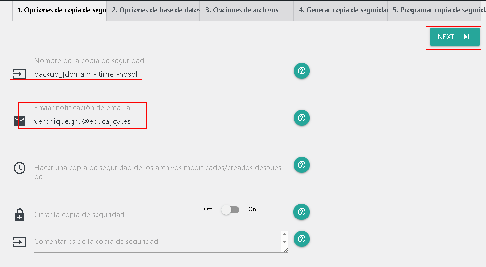
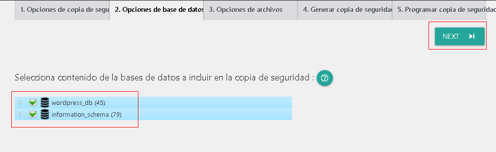
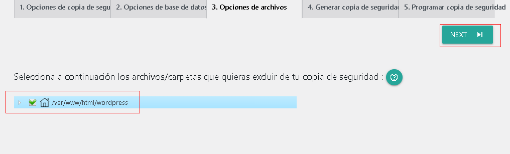
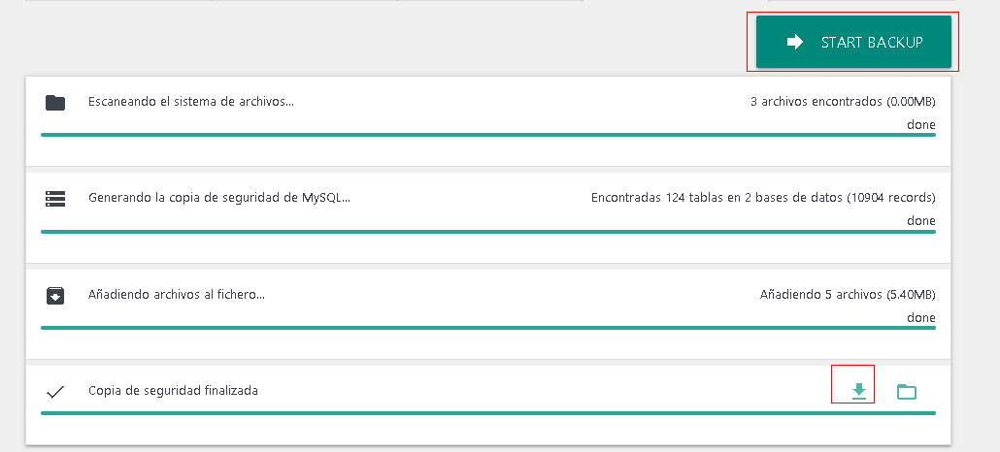
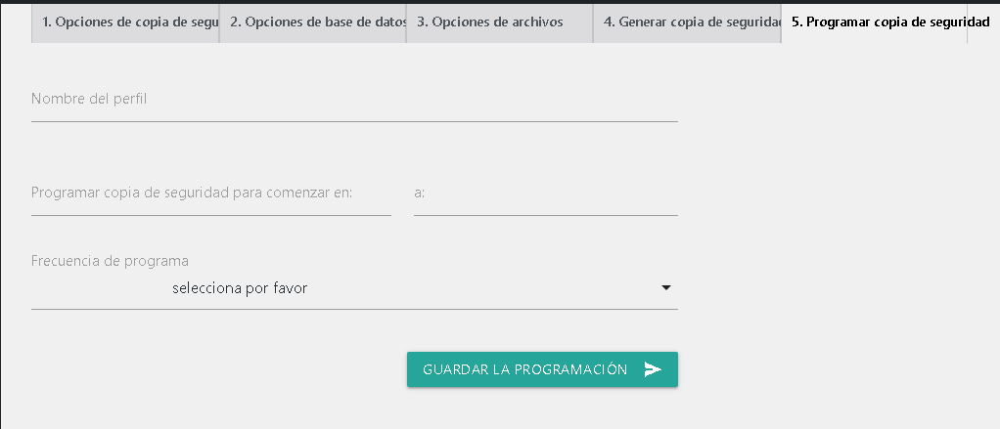
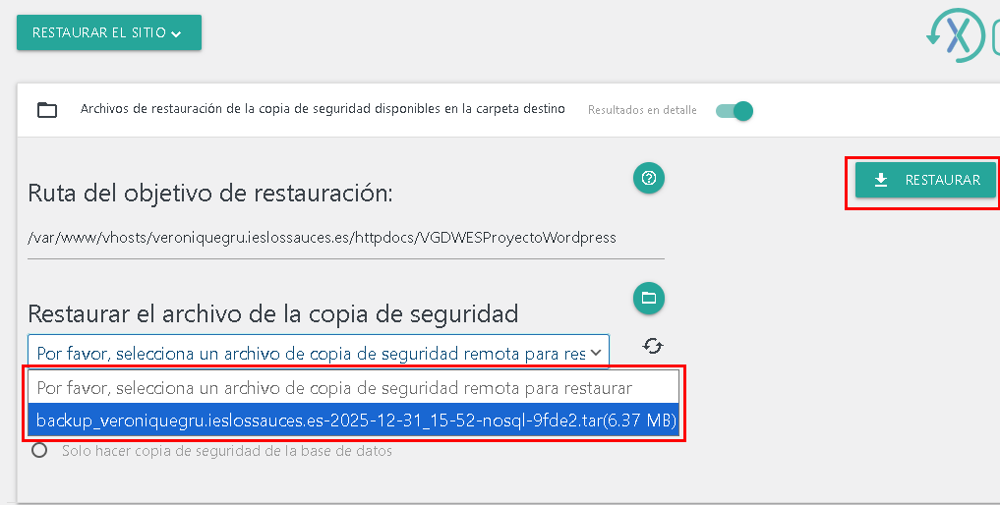

[volver al menú principal](README.md)  
[ir a Instalación de Wordpress](InstalacionWordpress.md)  
[ir a Estructura de Carpetas](EstructuraDeCarpetas.md)  
[ir a Uso de Wordpress](usoWordPress.md)  


# Guía de Migración de WordPress a Plesk y copia de seguridad.

Este documento presenta tres métodos para subir el proyecto desde el entorno de desarrollo al servidor de producción o para hacer una copia de seguridad.

---

## Método 1: Despliegue mediante Git 

1. **Preparación de la Base de Datos:**
   - Exportar la DB local (`.sql`).
```bash
mysqldump -u root -p wordpress_bd > wordpress_completo.sql
```
   - Abrir el archivo con un editor (VS Code) y hacer un *Buscar y Reemplazar*:
     - Buscar: `http://192.168.0.101/wordpress`
     - Reemplazar por: `https://VGDWESProyectoWordpress.veroniquegru.ieslossauces.es`
   - Se puede hacer también desde plesk. Después de crear las base de datos. En phpMyAdmin :
```sql
-- Reemplazar 'http://192.168.0.101/wordpress' con la URL real de Plesk
UPDATE wp_options 
SET option_value = 'https://VGDWESProyectoWordpress.veroniquegru.ieslossauces.es' 
https://veroniquegru.ieslossauces.es/VGDWESProyectoWordpress
WHERE option_name = 'siteurl';

UPDATE wp_options 
SET option_value = 'https://VGDWESProyectoWordpress.veroniquegru.ieslossauces.es' 
https://veroniquegru.ieslossauces.es/VGDWESProyectoWordpress
WHERE option_name = 'home';
```

2. **En Plesk:**
   - Crear un sitio de WordPress vacío.
   - Abir la herramienta **Git** en Plesk y añadir la URL del repositorio de GitHub.
   - Configurar el despliegue automático hacia la carpeta `httpdocs`.
3. **Base de Datos:**
   - Acceder a `Bases de datos > phpMyAdmin` en Plesk e importar el archivo `.sql` modificado.
4. **Sincronización:**
   - Editar el archivo `wp-config.php` en Plesk para que coincida con el nombre y contraseña de la base de datos creada en el hosting.

---

## Método 2: Migración Manual (FTP/MobaXterm)

1. **Subida de archivos:**
   - Descargar el proyecto desde GitHub o comprimir la carpeta `/var/www/html/wordpress` en un `.zip`.
   - Subir el contenido a la carpeta raíz del dominio en Plesk mediante el **Administrador de archivos** o **Moba**.
2. **Base de Datos:**
   - Exportar la DB local y realizar el *Buscar y Reemplazar* de la URL (igual que en el Método 2).
   - Crear una base de datos nueva en Plesk e importar el SQL.
3. **Ajustes de Configuración:**
   - Editar `wp-config.php` en Plesk con los nuevos credenciales:
     ```php
     define('DB_NAME', 'nombre_db_plesk');
     define('DB_USER', 'usuario_db_plesk');
     define('DB_PASSWORD', 'contraseña_plesk');
     define('DB_HOST', 'localhost');
     ```

---

## Copia de seguridad: Uso de Plugin en este caso XCloner

1. **Crear copia de seguridad:**
   - Instalar el plugin **XCloner**.
   - Ir a `Copia de seguridad del sitio > Generar copia de seguridad`
   - Configurar las opciones de seguridad.
   
   - Configurar las opciones de la base de datos.
   
   - Configurar las opciones de archivos.
   
   - Generar y descargar la copia de seguridad.
   
   - Programar las copias de seguridad si se quiere.
   
2. **Restaurar copia de seguridad**
   - Se va a Copia de seguridad del sitio-Restaurar el sitio. Se elije el backup y se hace clic en restaurar.



---
