[volver al menú principal](README.md)  
[ir a Instalación de Wordpress](InstalacionWordpress.md)  
[ir a Estructura de Carpetas](EstructuraDeCarpetas.md)  
[ir a Guía de paso a Plesk](GuiaPasoAPlesk.md)  

# CREACIÓN DEL CRUD DE LA TABLA DEPARTAMENTOS
## INSERSIÓN DE LA TABLA DEPARTAMENTOS EN LA BASE DE DATOS DE WP
* Se añade la tabla departamentos a la base de datos de wordpress.
* Se abre la base de datos con phpMyadmin.  
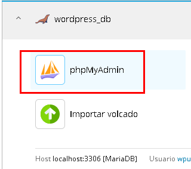   
* Se crea la tabla y se cargar.
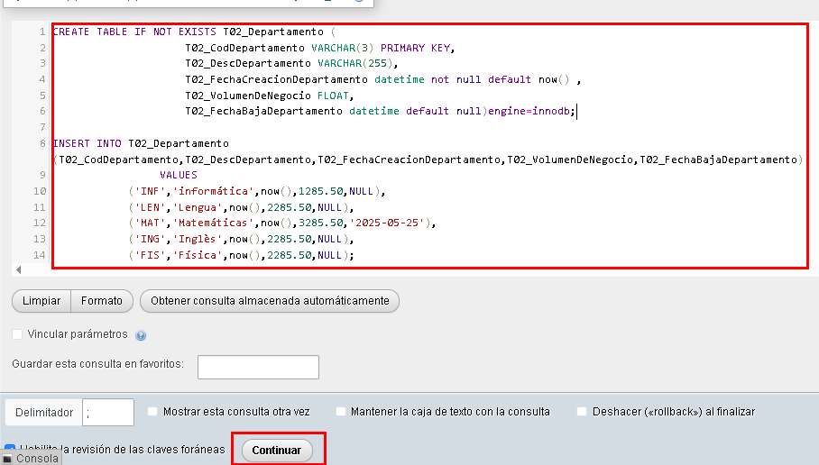  
* Aparecerá en la lista de tablas de la base de datos de wordpress.
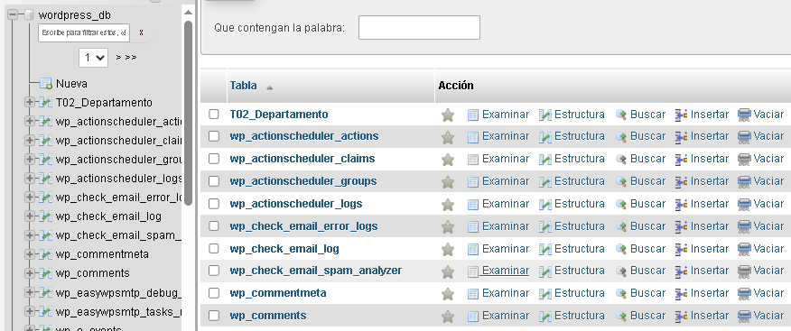 

## INSTALACIÓN DEL PLUGIN NECESARIO PARA HACER EL CRUD EN WP
* Para realizar el CRUD de departamentos, utilizaré el plugin de CRUDIATOR(he elegido este porque es el más utilizado para hacer CRUDs pero se podría utilizar otro).  
Se instala y activa el plugin.  
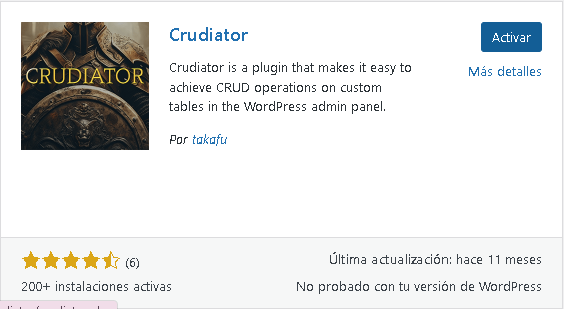  

## CREACIÓN DEL CRUD
* Se accede a Crudiator-Add a New Table en el menú principal de wordpress.  
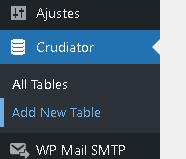
* Se elige la tabla en el desplegable que contiene todas las tablas de la base de datos.  
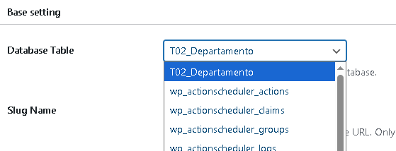  
* Se va elgiendo las opciones en función de lo que se necesite.  
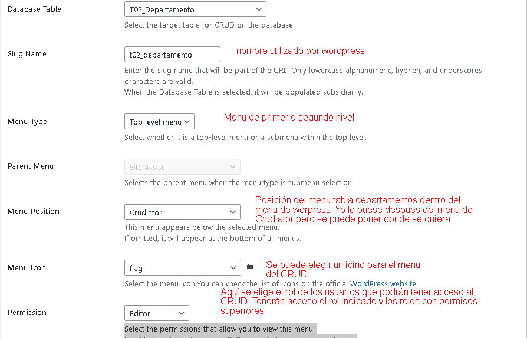 
* Al darle a publicar, aparece el menú de Mantenimiento de departamentos en el menu de Worpress debajo de Crudiator
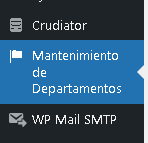  
* Si pinchas en él te aparece la tabla de mantenimiento de departamentos.
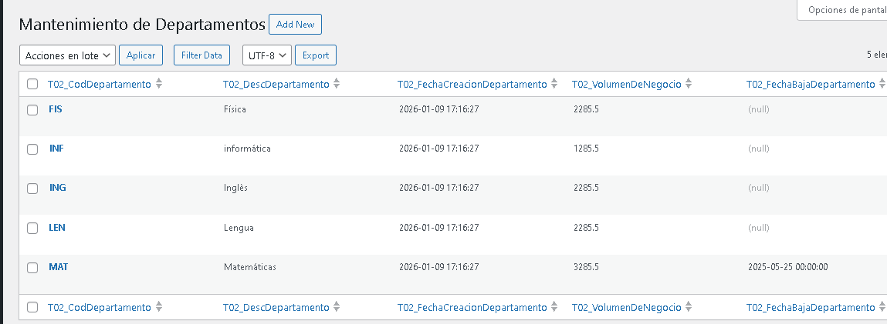  
La documentación de Crudiator se encuentra aquí:
https://crudiator.com/document/

## UTILIZACIÓN DEL CRUD DE MANTENIMIENTO DE DEPARTAMENTOS

### CREATE : CREACIIÔN DE DEPARTAMENTO
* Para crear un departamento se hace clic en Add New
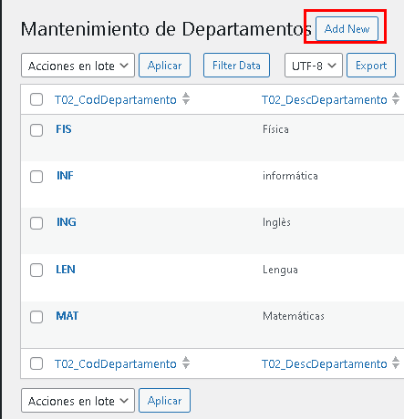  
* Se rellenan los campos del nuevo departamento.  
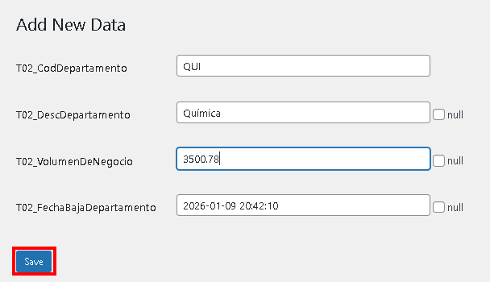
* Se indica que el departamento se ha creado bien.  
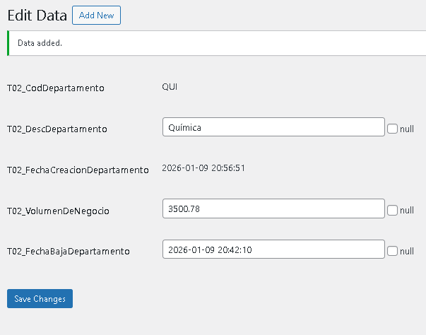  
* El nuevo departamento apararece en la tabla.  
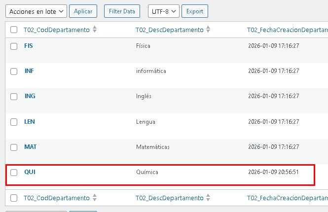
* Si se introduce un codigo repetido sale un error de Database.  
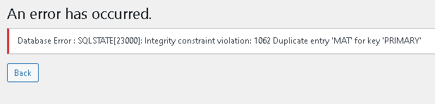    
al darle al boton volver los campos siguen con la información.  
El campo de volumen de negocio, no admite coma, solo punto. **La coma no da error, no se escribe**.  

### READ : CONSULTA DE UN DEPARTAMENTO
* Para consultar un departamento se hace clic en Filter Data en la parte de arriba d ela página de mantenimiento.  
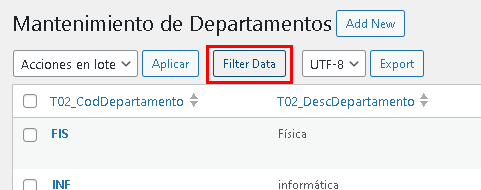  
Sale una ventana donde se  puede indicar el elemento de filtrado, que puede ser cualquiera de los campos.  
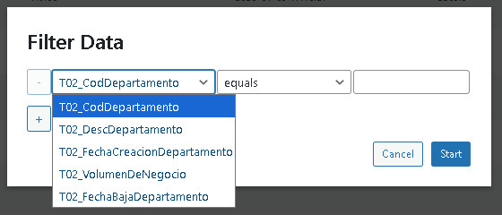  
En la parte central se elige el elemento de comparación (igual, mayor que, menos que, contiene...)  
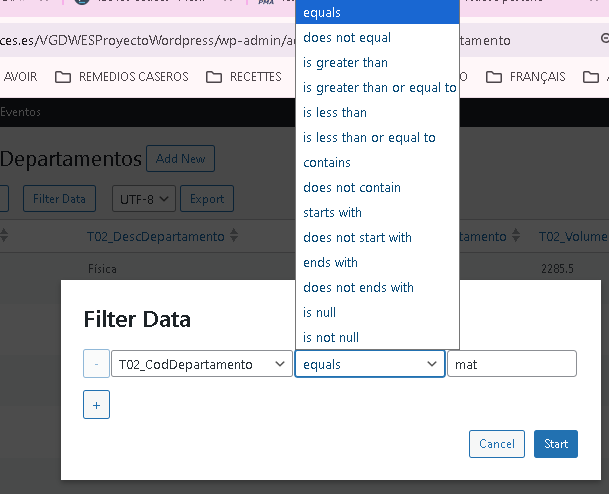  
En la ultima parte se indica el criterio de busqueda y se hace clisc en Start.  
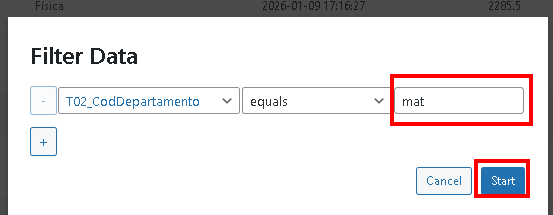  
* Aparece la tabla con los departamentos que correspondan al filtro.   
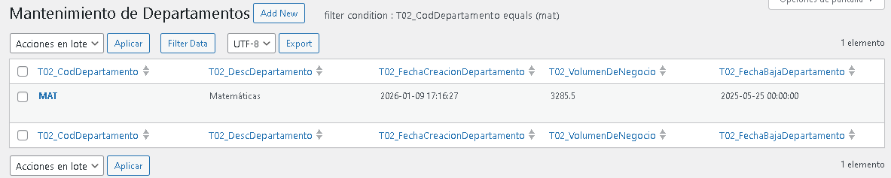  
* Al pasar el raton por encima del departamento aparece un menu. Al hacer clic en View.  
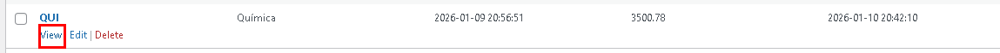  
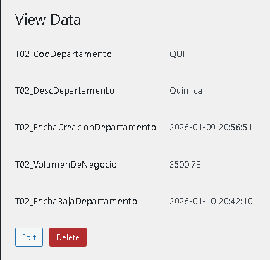  

### UPDATE : MODIFICACIÓN DE UN DEPARTAMENTO
* Para modificar un elemento pasar el raton en la linea del departamento, aparece un menu.  
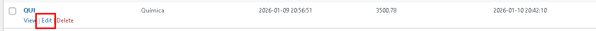    
Tambien se puede editar desde la consulta del Departamento.  
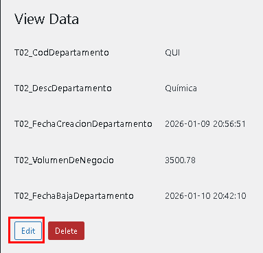  
* Se modifican los campos que se necesite.  
* 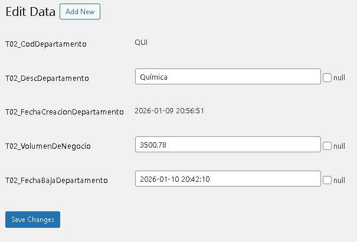  

### DELETE : BORRAR DEPARTAMENTO
* Para borrar un departamentose elige Delete en el menu del departamento.   
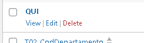  

**Con este plugin solo podrá tener acceso los usuarios con rol de administrador**
El plugin permite elegir el rol pero Wordpress no le da permiso.