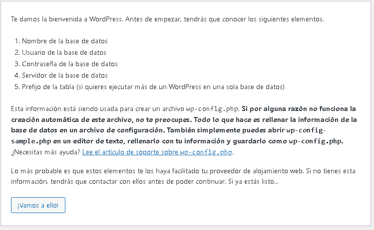
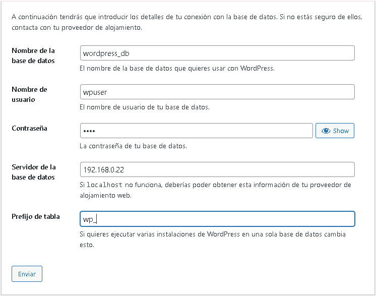
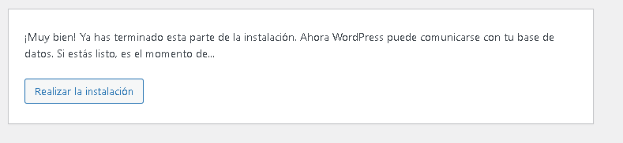
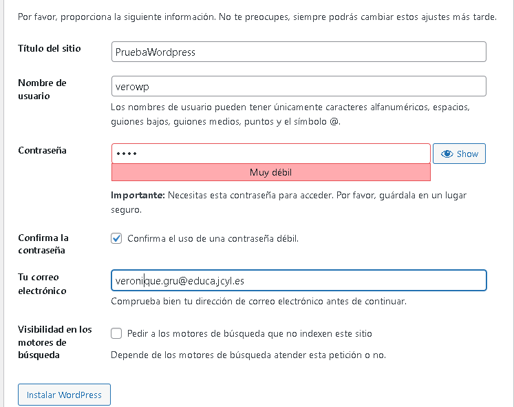
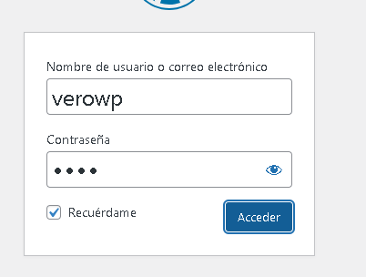
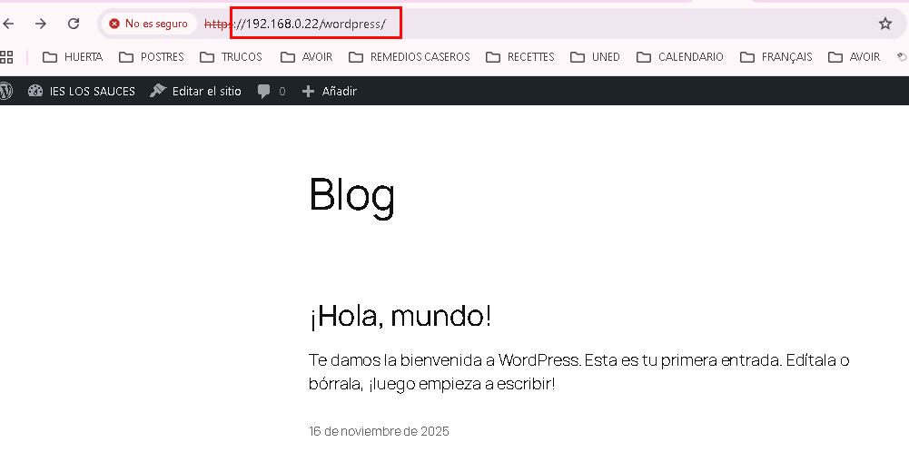

[volver]

# Instalación Wordpress.org en un servidor Ubuntu 24.04


## Descarga e instalacion en un servidor propio.
Para ello se recomienda tener instalado en el servidor:
 - Un servidor web(Apache o Nginx)
 - PHP 8.3 o superior
 - MySQL 8.0 o MariaDB 10.6 o superior

Se puede descargar desde la web y descomprimir en local:
https://wordpress.org/download/ o https://wordpress.org/download/releases/
Aqui se encuentra una guía para la instalación : https://codex.wordpress.org/es:Instalando_WordPress

o descargar en el servidor y descomprimir el fichero directamente allí.

```bash
# Se entra en la carpeta /tmp del servidor
cd /tmp
# Se descarga en la carpeta /tmp del servidor
wget https://wordpress.org/latest.tar.gz
# Se descomprime la carpeta de wordpress
tar -xzvf latest.tar.gz
# se mueve la carpeta wordpress a la carpeta html
sudo mv wordpress /var/www/html/
```


## Creacion de la base de datos
  * Se abre mariadb.
```sql
sudo mariadb;
```

  * Se crea la base de datos en el servidor
```sql
CREATE DATABASE wordpress_db;
CREATE USER 'wpuser'@'192.168.0.22' IDENTIFIED BY 'paso';
GRANT ALL PRIVILEGES ON wordpress_db.* TO 'wpuser'@'192.168.0.22';
FLUSH PRIVILEGES;
EXIT;
```

## Configurar permisos 
Se configuran los permisos para la carpeta wordpress
```bash
sudo chown -R www-data:www-data /var/www/html/wordpress
sudo chmod -R 775 /var/www/html/wordpress
```


## Configurar apache para wordpress
* Se hace una copia de archivo 000-default.conf. 

```bash
sudo cp 000-default.conf wordpress.conf
```
* Se entra en el fichero de configuración de wordpress en Apache.
```bash
sudo nano /etc/apache2/sites-available/wordpress.conf
```

* En el archivo de configuración hay que escribir esto
```bash
<VirtualHost *:80>
    ServerName localhost
    DocumentRoot /var/www/html/wordpress
    <Directory /var/www/html/wordpress>
        AllowOverride All
    </Directory>
</VirtualHost>
```

* Se activa el sitio wordpress y el modulo rewrite.(El módulo rewrite es un componente que permite reescribir y manipular las URL de manera dinámica desde el lado del servidor, basándose en reglas y patrones definidos para el SEO.)
```bash
sudo a2ensite wordpress.conf
sudo a2enmod rewrite
sudo systemctl restart apache2
```

## Se configura Wordpress
* Abrir en el navegador : http://192.168.0.22/wordpress/
y seguir los pasos...

* Elegir el idioma y dar a continuar  


* Aparece un mensaje con la información a tener a mano antes de seguir.  


* Se indica la informacion sobre la base de datos  
 

* Sale un mensaje para informar que la conexion con la base de datos es correcta. Hacer clic en Realizar la instalación.  
  

* Rellenar el formulario de instalación con los datos de usuario.   
 

* y sale un mensaje de confimración y se hace clic en acceder.  


* aparece un formulario para pedir las credenciales   


* Para acceder a worpress se escribe la ip/wordpress en el navegador
