# USO DE WORDPRESS

- [USO DE WORDPRESS](#uso-de-wordpress)
  - [1-ELECCIÓN DEL TEMA DE LA PÁGINA](#1-elección-del-tema-de-la-página)
  - [2 - PERSONALIZAR EL TEMA SIN PLANTILLA](#2---personalizar-el-tema-sin-plantilla)
  - [3 - PERSONALIZAR A PARTIR DE UNA PLANTILLA PREDISEÑADA](#3---personalizar-a-partir-de-una-plantilla-prediseñada)
  - [4 - PERSONALIZAR LA CABECERA Y EL PIE DE PÁGINA.](#4---personalizar-la-cabecera-y-el-pie-de-página)
  - [5 - CREAR LA PÁGINA DEL LOGIN Y LA DE REGISTRO](#5---crear-la-página-del-login-y-la-de-registro)
  - [6 - CREAR UNA TABLA PARA LOS CORREOS DE USUARIOS DE LA NEWSLETTER.](#6---crear-una-tabla-para-los-correos-de-usuarios-de-la-newsletter)
  - [7 - PERSONALIZAR LOS COMENTARIOS.](#7---personalizar-los-comentarios)
  - [8 - AÑADIR UN CALENDARIO DE EVENTOS](#8---añadir-un-calendario-de-eventos)
  - [9 - PLUGIN PARA FACILITAR EL ENVÍO DE CORREOS ELECTRÓNICOS](#9---plugin-para-facilitar-el-envío-de-correos-electrónicos)

## 1-ELECCIÓN DEL TEMA DE LA PÁGINA
* En el panel de administración se va a Apariencia-Panel  
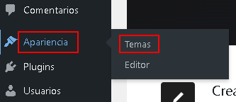  
Hay viene un tema por defecto, se puede hacer la página con este   
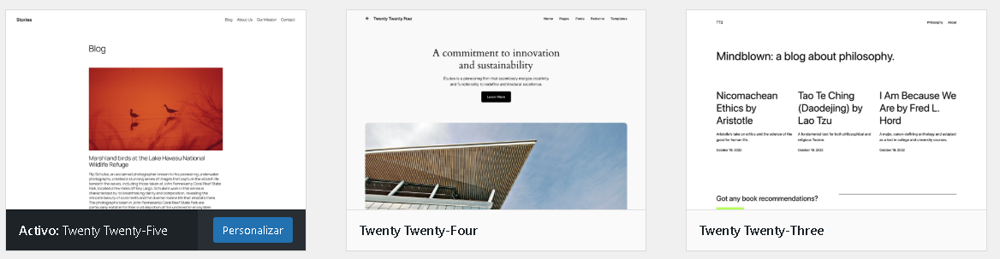   
o elegir otro. Si se elige otro es mejor borrar los que no se van a utilizar por seguridad. Para ellos se hace clic en el tema y se le da a borrar en la parte inferior.  
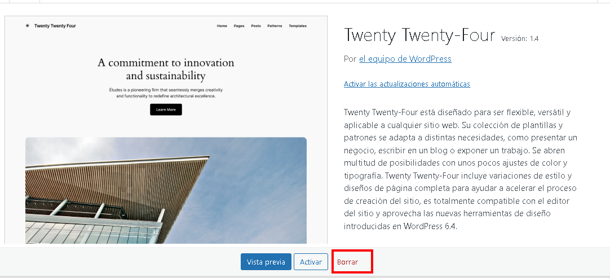  
Solo se puede borrar si no es el Tema activo.  
* Para elegir otro tema que no sea el predeterminado, se pincha en Añadir Tema en la parte de arriba.  
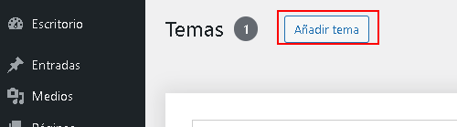  
Se puede ir mirando los temas para ver cual es el que se ajusta más a los que uno quiere, o se puede poner en el buscador el tema que se quiere en el caso de saberlo.
Yo voy a elegir el tema Kadence que es uno de los más utilizado. Se pincha en instalar.  
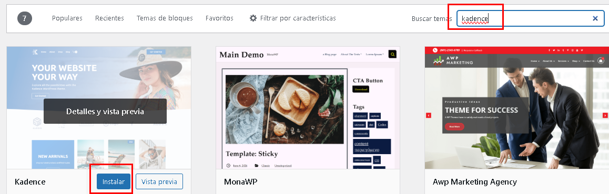    
Se activa y se borra la que estaba activa hasta ahora.  
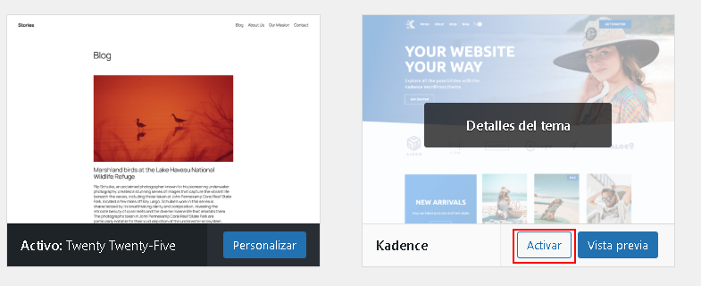  

**Si la personalización va a ser importante y se va a hacer muchas modificaciones del tema principal, es mejor crear un tema-hijo (theme-child) para que las actualizaciones del tema padre se añadan al thema hijo sin sobrescribirlas.**
* En este video explican como hacerlo. https://www.youtube.com/watch?v=Cp8XDIFNUWs&t=69s   
Es mejor hacerlo antes de empezar a crear el sitio.

## 2 - PERSONALIZAR EL TEMA SIN PLANTILLA
* Se pincha en Personalizar se entra en el area de personalización del tema.  
Ahí se puede personalizar el tema y adaptarlo a sus necesidades y gustos. Se puede personalizar, los colores y las fuentes, la cabecera, el pie de paágina, el diseño de entradas y páginas, el menú ...  
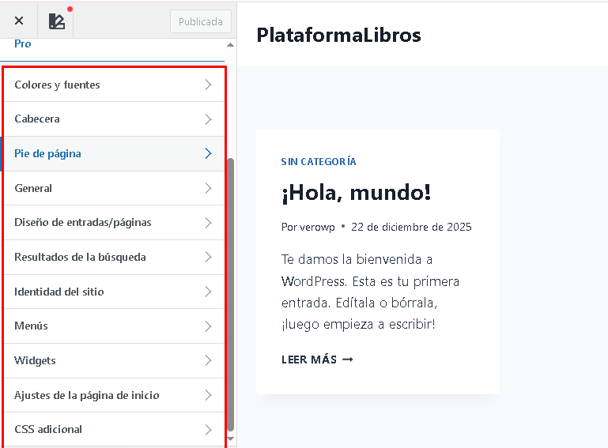 
Ya se podría ver el hola mundo de ejemplo en la página. Entrando en  https://192.168.0.101/wordpress/
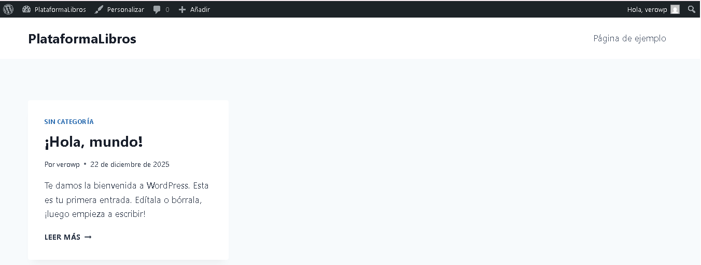 

## 3 - PERSONALIZAR A PARTIR DE UNA PLANTILLA PREDISEÑADA
* En el menú de la izquierda, ir a Apariencia-Temas y Se instala el AI Starter Templates.  
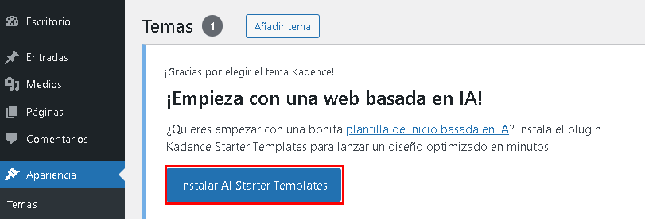  
y se hace clic en "Click to get started"    
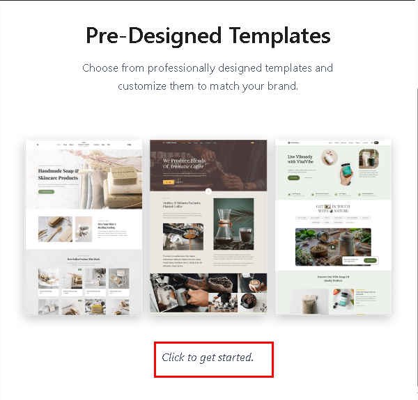
Y se elige la plantilla que más os guste. Se pueden filtrar las plantillas para ver solo las gratis.  
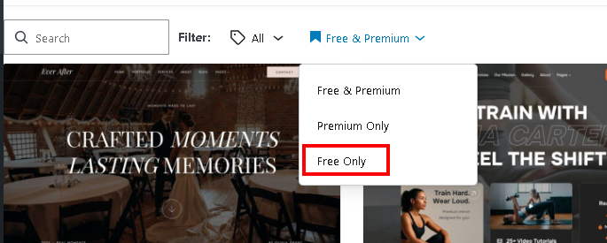  
* Para este proyecto se utilizará esta plantilla.  
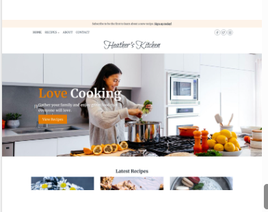  
Después de elegir la plantilla, se puede ir personalizando, los colores, la fuente, 
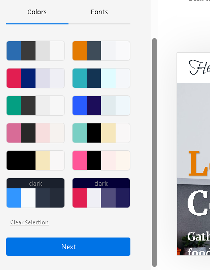    
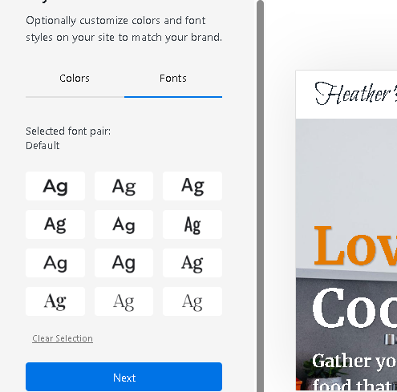  
y se puede elegir importar, algunas paginas o todas las paginas, de la plantilla.
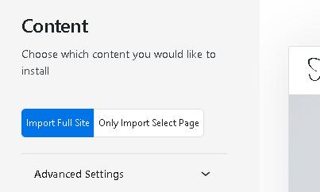  
y para terminar se podrán elegir algunos plugins. Algunos ya vienen señalados para incluirlos en la plantilla y se pueden añadir otros que se necesiten. Si no se añaden ahora se pueden añadir más adelante. Se hace clic en "Finish and Launch"
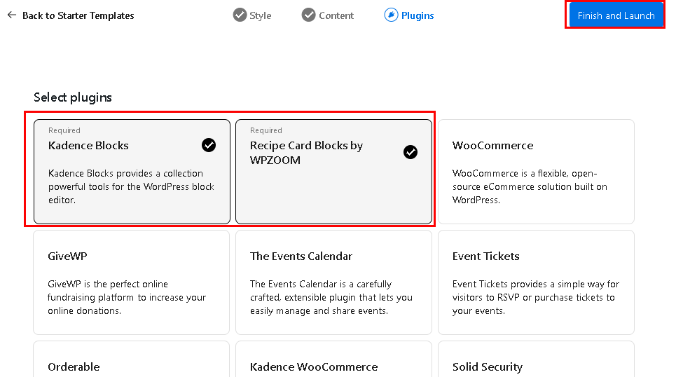  

## 4 - PERSONALIZAR LA CABECERA Y EL PIE DE PÁGINA.
* En el menú general de la iquierda se va a Apariencia- Personalizar.

Y en el menu de la izquierda de Personalizar se encuentran todas las secciones que se pueden personalizar.
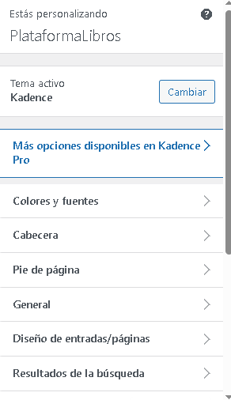   
* En el menu de la derecha se puede indicar que aparezcan el formulario de comantarios. Si no hay formulario personalizado aparecerá el fomulario del tema en las entradas, justo encima del pie de página.
* Para que solo sean los usuarios registrados los puedan añadir comentarios. Ajustes-Comentarios
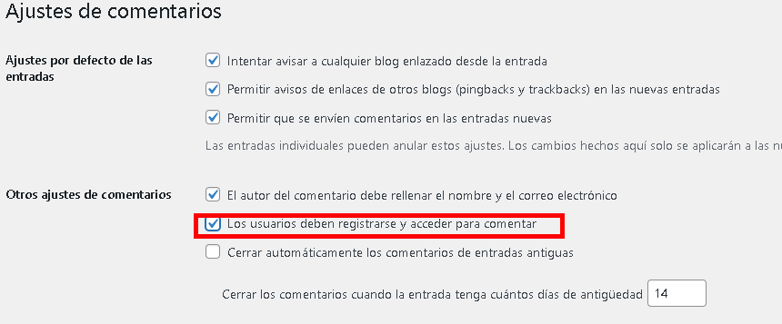

## 5 - CREAR LA PÁGINA DEL LOGIN Y LA DE REGISTRO

* Para crear el login se instala el plugin Ultimate Member.
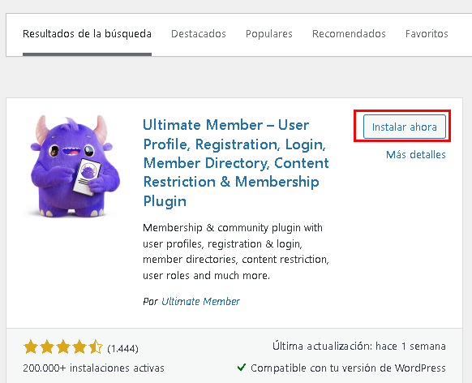
* Una vez instalado y acticvado el plugin, se pincha en Create Pages
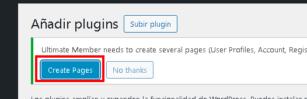
* En la seccion users es donde se define el rol por defecto  
* 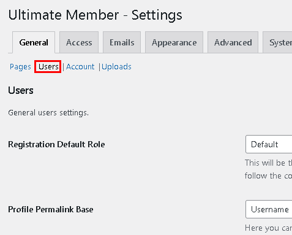
* En la sección User Role se editan los permisos que cada rol. 
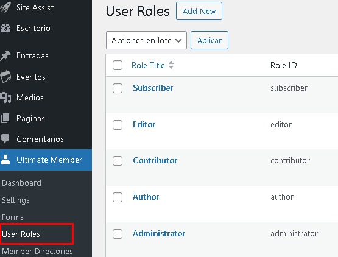
* En el rol de subscriptor cambié el estado de registro. Por defecto viene que el registro se hace automaicamente y lo cambié por la opcion que require la aprobación del adiministrador.
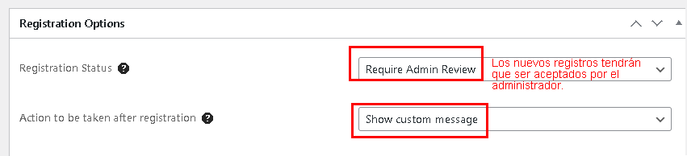  
* en la parte de abajo se puede elegir el las acciones despues de logearse, de cerrar sesión y después de borrar la cuenta.
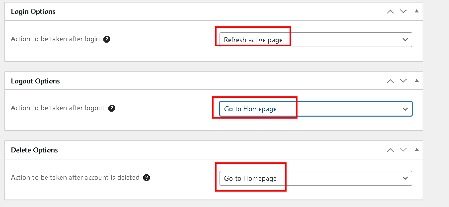
* Para crear usuarios se va la sección de usuarios y se pincha en crear.

* Para personalizar la pagina de Login, se pincha en Ultimate Member y en Forms. Ahí se puede personalizar el login, añadir y borrar campos que vienen en el login por defecto y personalizar cada campo.
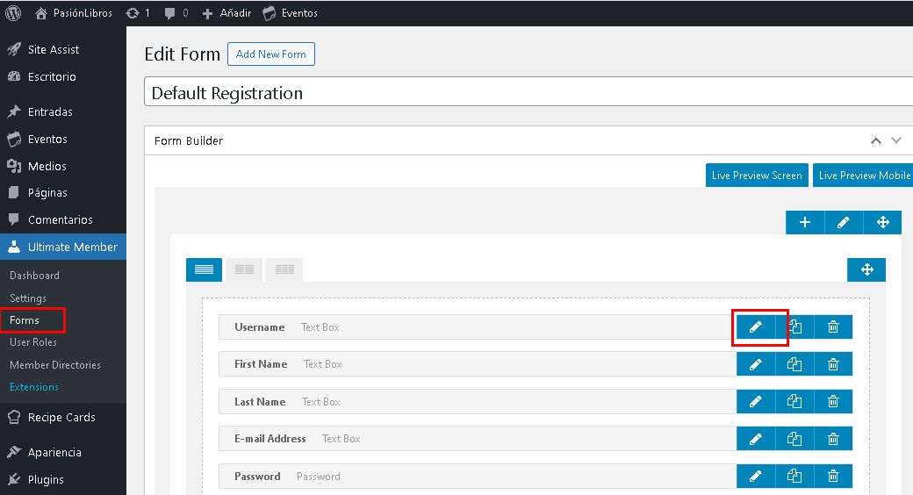.
* Cuando se pincha en la edición de un campo se puede personalizar varias cosas.  
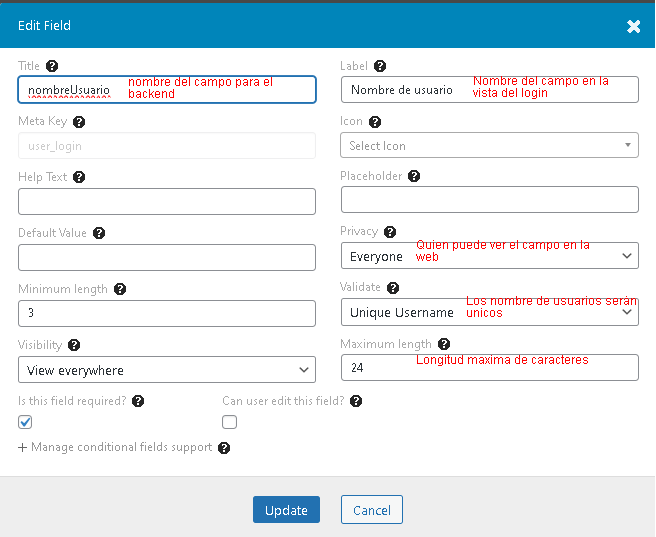

* Para que aparezcan las paginas de login y registro en la pagina web hay que añadirlas al menú.
Apariencia - Menú del menú de administración.
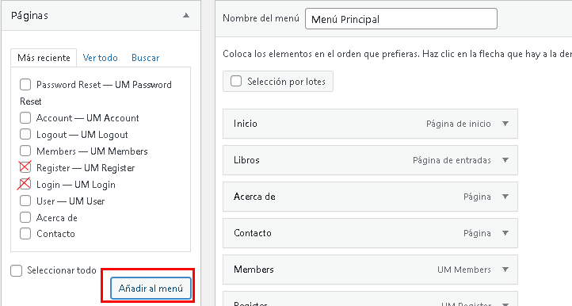  

* Los correos de notificación están en inglés, se puede cambiar el mensaje en Ultimate Member - Settings - Emails.  
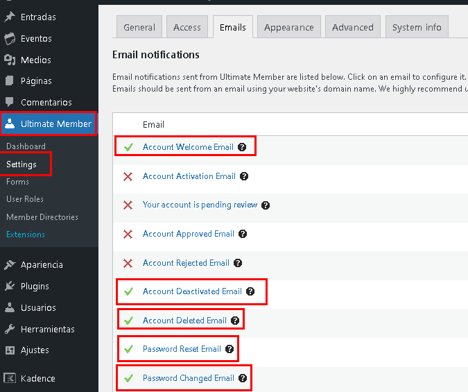  

## 6 - CREAR UNA TABLA PARA LOS CORREOS DE USUARIOS DE LA NEWSLETTER.
* En la página de inicio tengo un formulario para que los usuarios puedan suscribirse a la newsletter.
El tema gratis de Kadence no permite almacenar los mails de los suscriptores pero se puede hacer una simulación con una plugin para ver el funcionamiento. De momento la versión gratis del plugin, no permite enviar las newsletters a los usuarios. Hasta que no esté el proyecto en plesk, no se puede saber si funciona adecuadamente.

* Se instalan y se activan estos plugins
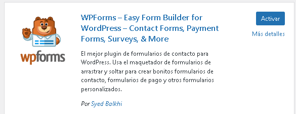
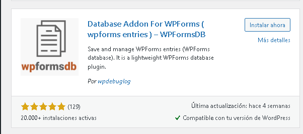  
se encuentra la guia en inglés aqui: https://wpforms.com/docs/creating-first-form/?utm_campaign=liteplugin&utm_source=WordPress&utm_medium=welcome-page&utm_content=Read%20the%20Full%20Guide&utm_locale=es_ES  

* Se crea el fomulario con el plugin. 

* Se puede elegir una plantilla existente o crearlo desde cero.  
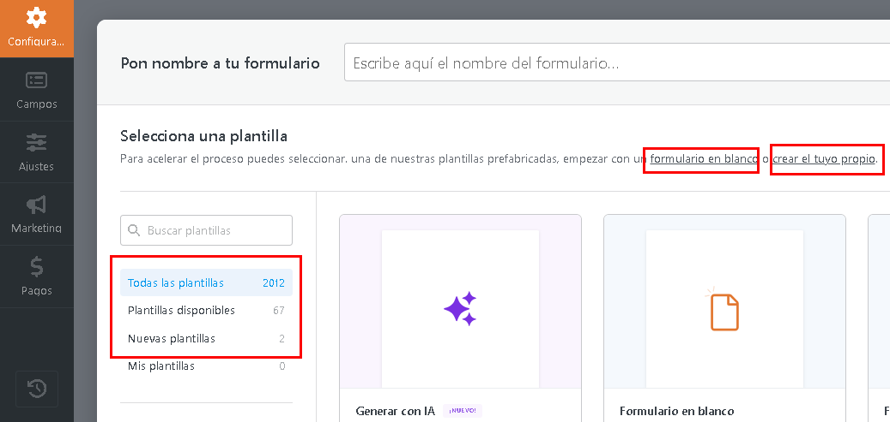

* Si se elige crearlo desde cero se abre el maquetador y se va arrastrandolos campos que se necesitan
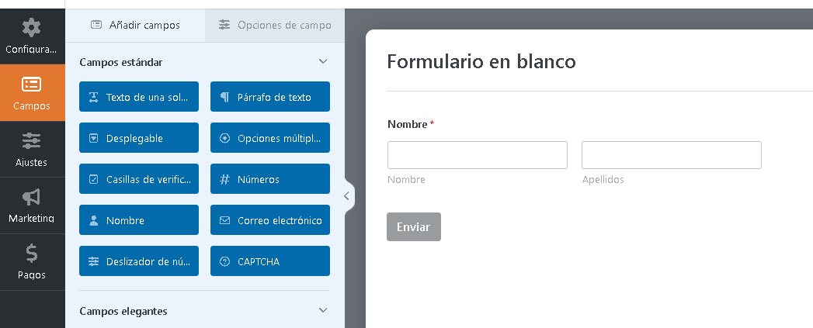
y al hacer clic en el campo del formulario se abre el menu de personalizacion del campo.  
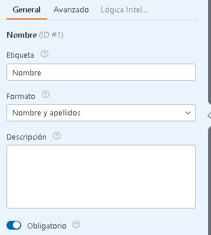  

* Para ver la tabla de los usuarios suscritos a la newsletter se accede a WPForms DB y aparece la lista de los formularios, se elige el que se quiera ver  
* 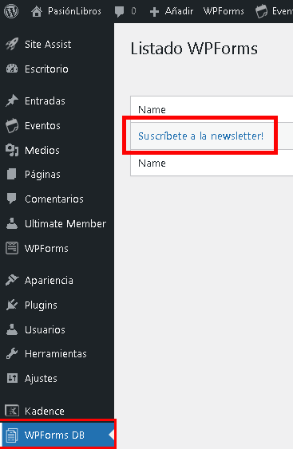  
y aparece la tabla con la lista de los usuarios suscritos
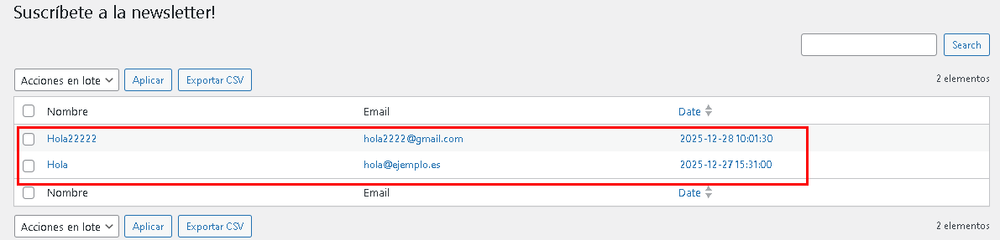

* Una vez que el proyecto esté alojado en Plesk, para poder enviar las newsletter y que no acaben en la bandeja de spam del usuario, habría que utilizar herramientas como MailerLite, Mailchimp o Brevo. 

## 7 - PERSONALIZAR LOS COMENTARIOS.
* Para poder personalizar los comentarios se puede utilizar el plugin wpDiscuz.
Una vez instalado y activado hay que confirgurarlo.
Se elige el estilo y el layout que más te guste
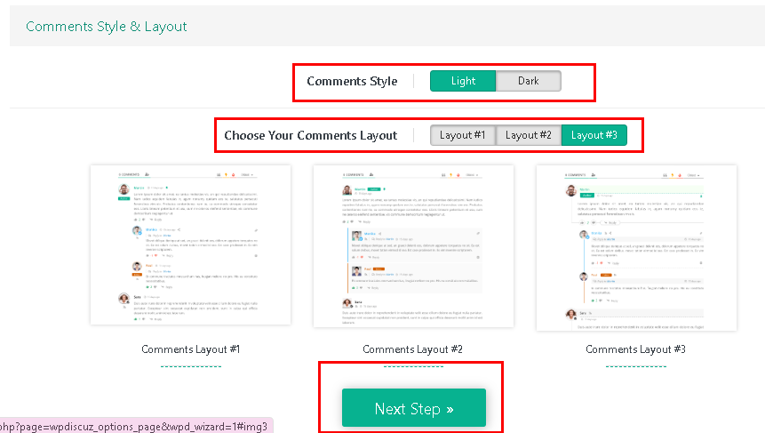
Se elige la presencia o no del icono de comentario y donde se quiere poner.
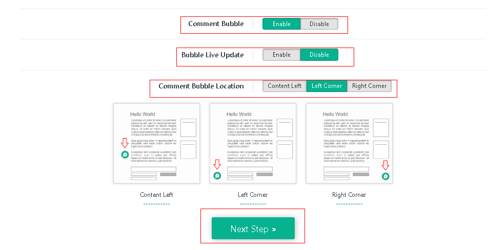
Se va a wpDiscuz - Setting y se personaliza el formulario de comentarios
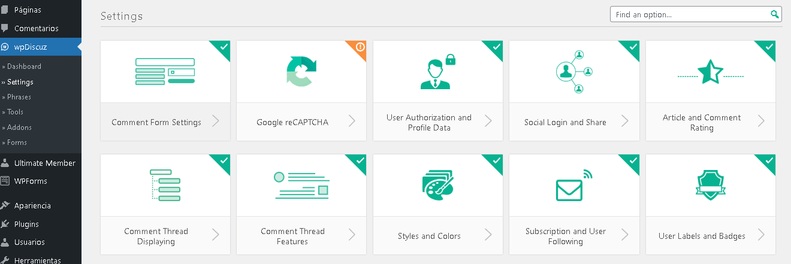

## 8 - AÑADIR UN CALENDARIO DE EVENTOS
* Se instala el plugin The event Calendar.
* En la pestaña de Ajustes se pueden configurar los enlaces de los eventos y el formato de la fecha.
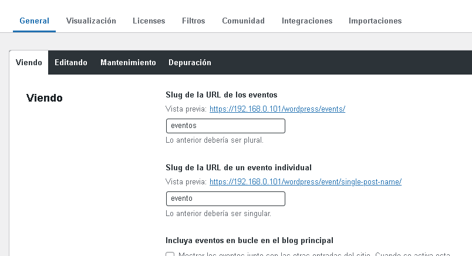
* Hay que configurar el formato de fecha y hora porque viene en el formato inglés.
En esa sección hay un enlace de ayuda a como configurar una fecha en PHP con date()
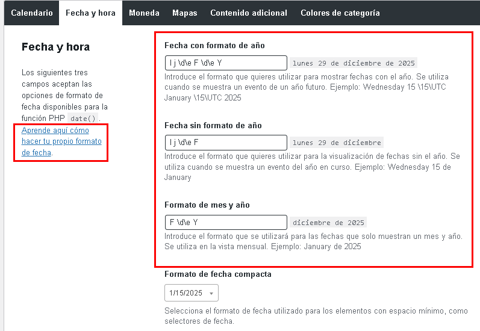  
* Para añadir un evento nuevo, se hace clic en Eventos-Añadir nuevo evento del menú principal. Se indican los datos del evento y se hace clic en publicar.
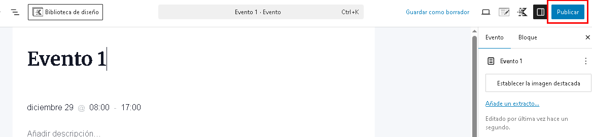  
* Para ver la tabla de eventos se hace clic en Eventos-Eventos en el menú principal.
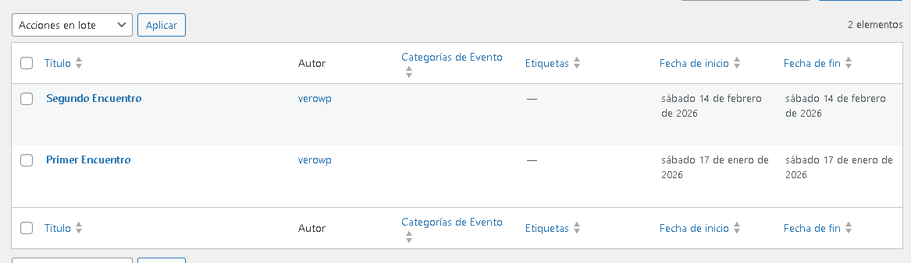

* Para que los usuarios se puedan inscribir a los eventos y poder tener un control sobre los asistentes a los encuentros, se puede instalar el plugin de event Tickets que sugiere el plugin The event calendar.
**Esta parte solo se podrá hacer cuando el proyecto esté subido a explotación. Desde el servidor local no se puede conectar a la API Rest y no permite añadir esa funcionalidad**
En Tickets-Ajustes-Pagos se activa Tickets Commerce  
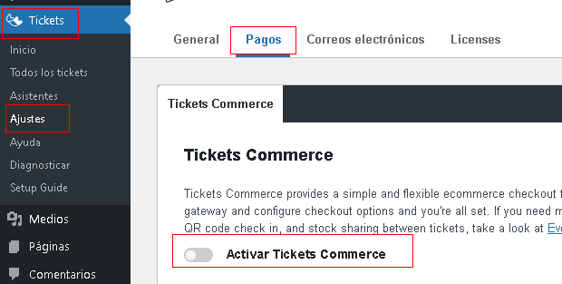  
A partir de ahora al crear el evento aparecerá el añadir una entrada y RSVP (confirmar asistencia)  
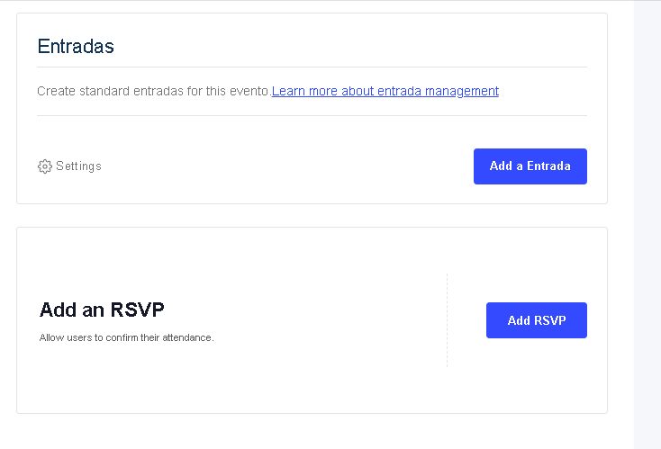
Ticket  
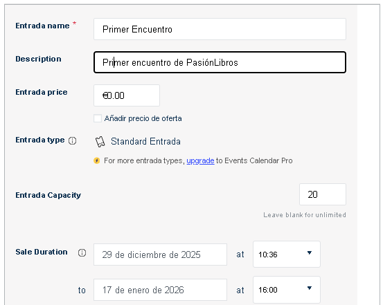
Confirmación Asistencia

## 9 - PLUGIN PARA FACILITAR EL ENVÍO DE CORREOS ELECTRÓNICOS
* Para que pueda funcionar bien el envío de mails desde la pagina de wordpress se necesita un sercicio de SMTP (Simple Mail Transfer Protocol (Protocolo simple de transferencia de correo)). Esto permite enviar los correos electrónicos del sitio a través de un servidor de correo electrónico dedicado. Esto significa que el sitio puede enviar correos electrónicos de manera más confiable y es menos probable que esos correos terminen en las carpetas de spam de los usuarios.
* Para ello, vamos a utilizar el plugin WP Mail SMTP que es uno de los más utiizados.
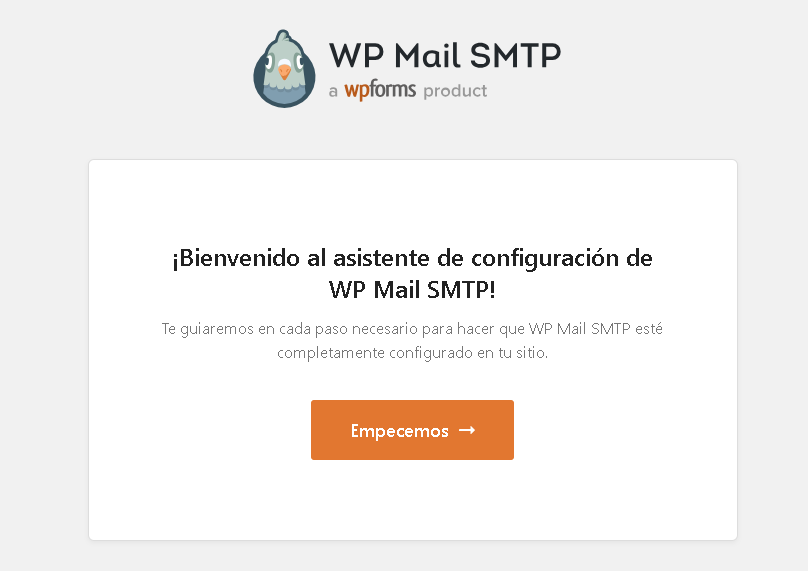
Hay que elegir un servicio smtp, he elegido Brevo porque dentro de los que son gratis, tiene mayor capacidad de recepción de correos.
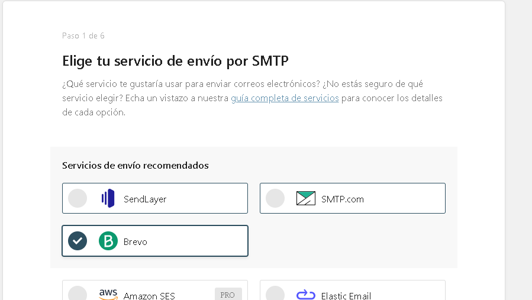
Hay que crear una cuenta en Brevo 
En el caso de que no se reciba el sms para confimrar el numero de telefono, se puede enviar un mail a los administradores de Brevo y en el plazo de 24-48h dan solución al problema. Hasta que no se configure del todo la cuenta, no se puede utilizar la clave API para el protocolo de correo.
Si no se hace nada, solo se enviarán los correos de educa.
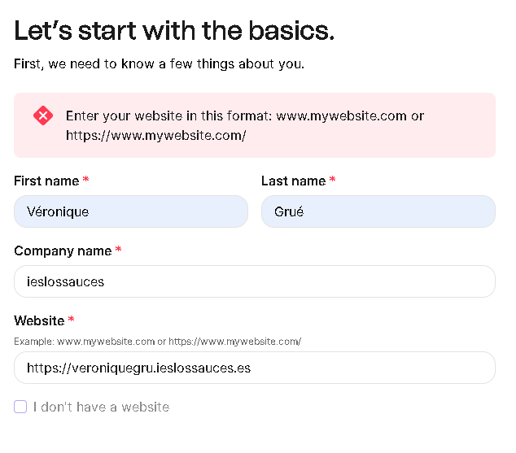  
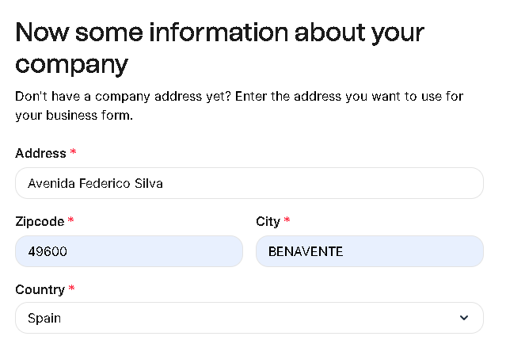  
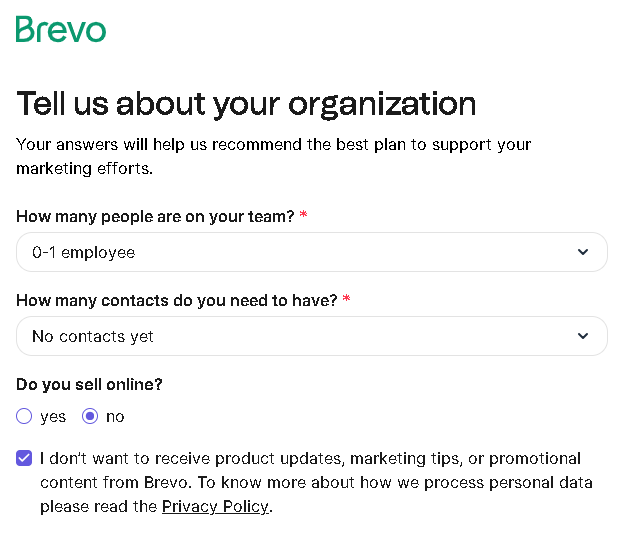  
En ese momento se recibe un mail con el enlace con la configuración y desde ahi se genera la clave Api SMTP
Se genera la Api, se copia
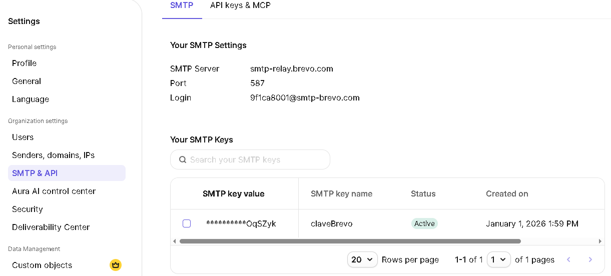  
Y se pega en wordpress, en WP Mail SMTP-Ajustes y en la parte de abajo está la sección donde hay que pegar la clave
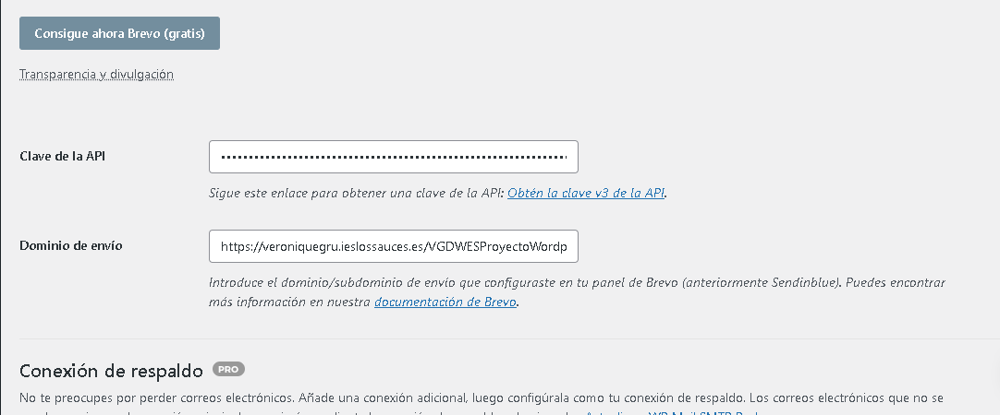  

	
